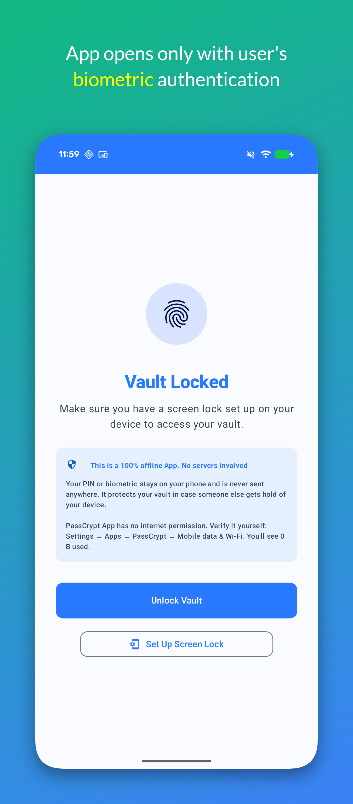
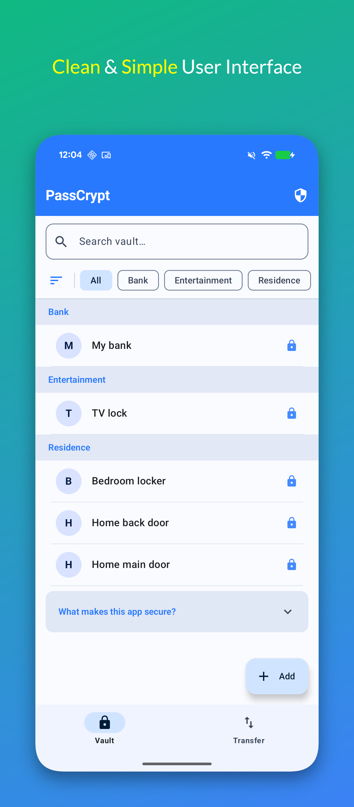
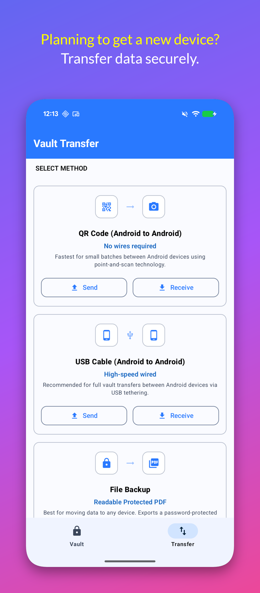
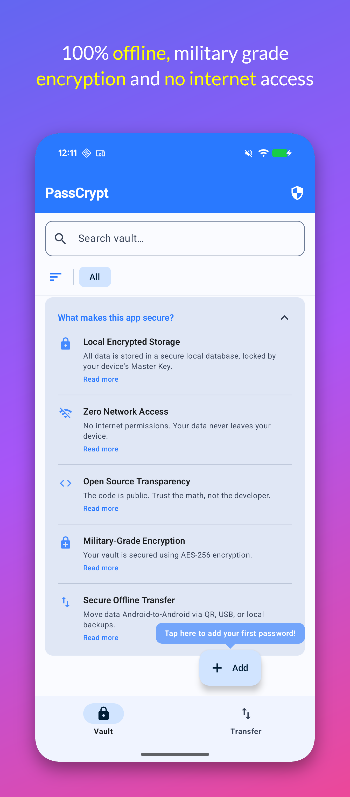
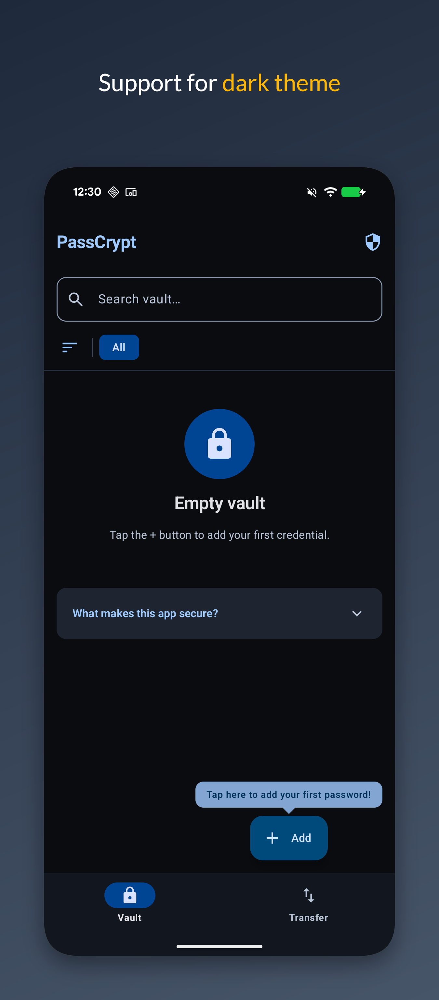
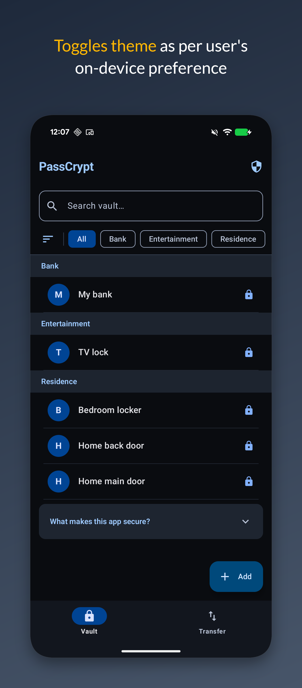

# Offline Password Manager
[](https://play.google.com/store/apps/details?id=com.lightdarktools.passcrypt)

**Offline Password Manager** is a modern, high-security Android password manager built with a **Zero-Knowledge, Offline-First** architecture. Unlike cloud-based solutions, Offline Password Manager stores all your credentials exclusively on your device, ensuring you have absolute control over your sensitive data.

It offers a streamlined workflow for organizing your digital identity while maintaining a strict "no-internet" policy. The interface is designed to be both powerful for power users and intuitive for everyone, featuring a responsive design that looks stunning in any theme.

## Security Architecture

Offline Password Manager is designed for users who don't want their most sensitive secrets touching the internet.

- **Zero Network Access**: The app does not request the `INTERNET` permission. It is physically impossible for data to be transmitted to any server.
- **Local-Only Storage**: All data is stored in a hardware-backed encrypted database using **AES-256** encryption via **SQLCipher**.
- **Hardware-Backed Keys**: Your encryption keys are tied to your device's secure enclave (Biometrics/PIN), ensuring they never leave your hardware.
- **No Analytics**: We collect no telemetry, track no usage, and have no way of knowing who you are.

## Key Features

- **Offline-First**: Reliable, fast, and completely private.
- **Multi-Mode Transfer (Android-to-Android)**: QR Code chunks move small batches via encrypted, point-and-scan transfer.
- **Cross-Platform Readiness**: Export an encrypted PDF for manual recovery or a CSV compatible with Apple's iCloud Keychain.
- **Biometric Unlock**: Secure and convenient access via Fingerprint or Face Unlock.
- **Modern Jetpack Compose UI**: A premium, responsive design.

## Interface & Themes

Experience Offline Password Manager in both Light and Dark themes. The UI automatically adapts to your system settings for a comfortable viewing experience.

     

## Built With

- **Kotlin** & **Jetpack Compose** for a modern UI.
- **Room Persistence Library** for structured data.
- **SQLCipher** for 256-bit AES database encryption.
- **PDFBox-Android** for secure PDF generation.
- **Coroutines & Flow** for reactive data handling.

## Build Instructions

To build Offline Password Manager from source, you will need **Android Studio Ladybug** (or newer) and **JDK 17+**.

1. Clone the repository:
   ```bash
   git clone https://github.com/yourusername/PassCrypt.git
   ```
2. Open the project in Android Studio.
3. Sync Project with Gradle Files.
4. (Optional) Provide your own `release_keystore` for signing.
5. Build and run on your device.

*Note: The official release in the root directory is signing-protected. You must use your own keys for custom builds.*

## License

Offline Password Manager is released under the **GNU General Public License v3.0 (GPL-3.0)**. See the [LICENSE](LICENSE) file for more details.

---

*This project is for educational and personal use. Security is our priority, but always ensure your device itself is secure.*
